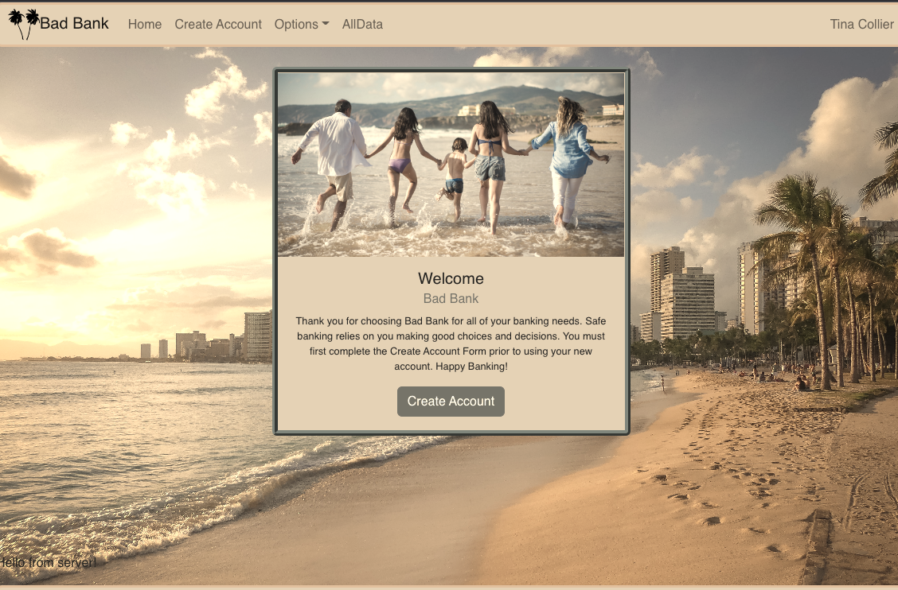

# Tina Collier's Bad Bank App

## What Is It?
For this MITxPro Coding Bootcamp challenge, we were tasked with creating a banking app that allows the user to create an account, deposit and withdraw money, and keep track of the data using the MERN (MongoDB, ExpressJS, React, NodeJS) Stack.

## How To Use It
Visit my [TieredBadBankApp](https://tieredbadbankproject.herokuapp.com/). Select `Create Account` and create a profile with a username, email, and password. If you already have an account, select login and use your previous email and password to access your account. Next, you may create another account or make a deposit or withdrawal. If you choose to make a deposit or withdrawal, you must input a valid number. Each deposit and withdrawal is saved in the transaction data for the current session. If you choose to create a new account, the previous user and their balance is replaced with the new user. You can choose to view your transaction for the current session by selecting `All Transactions`. If you would like to see all accounts, select All Data. 

## What I Found Challenging
One thing I found challenging was including the News Search page and pagination. I wanted to contain the results within the `Card` and keep the results below 5 items per page. Creating the back end was a struggle for me as well. It took a lot of trouble-shooting, Postman, and help from a friend to set up my APIs. By far the most challenging part was connecting my MongoDB database to my deployed Heroku app. It took me several days and many Google searches to figure out that I needed to `await` each and every step of making API calls to my database. 

## Extras
I added a Calculator Page and a current Financial News Page. I also included a table of transactions for each current session. In the future, I plan on saving the transaction history to the database so users can keep track of all deposits and withdrawals. 

## MIT License
Please see attached License

